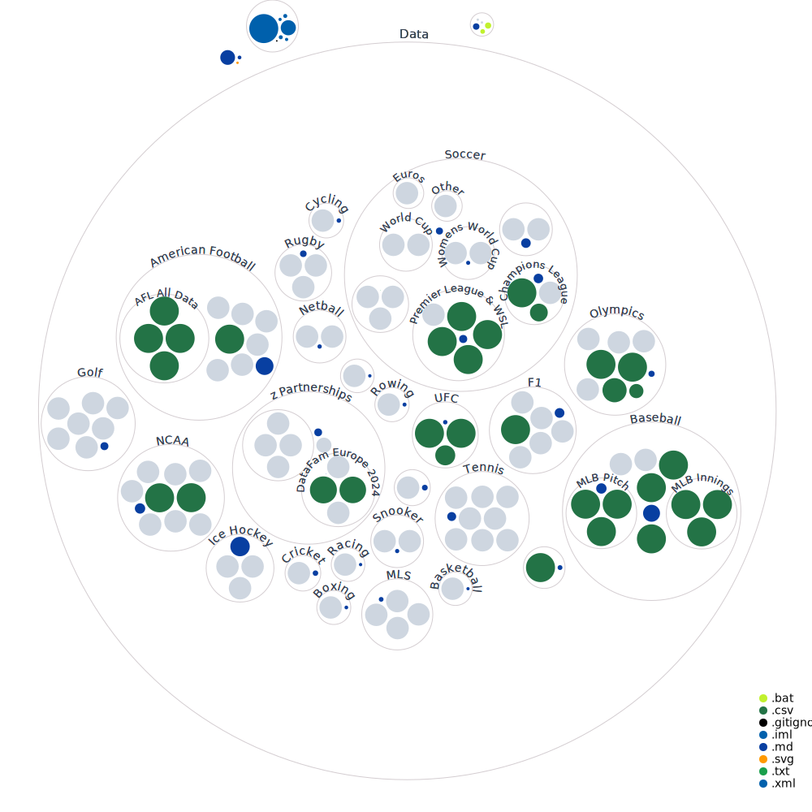

<!-- PROJECT LOGO -->
 

  
  
<!-- ABOUT THE PROJECT -->
## Welcome To SportsVizSunday

  

    Sports Viz Sunday is a place for people to combine two of the greatest things in the world: Sports and data.
    We frequently release new datasets for you to pull insights out of and share in the form of data visualisation.
    Share your entry through the hashtag #SportsVizSunday on Twitter and keep up with the blog to see what other sports fans are creating. 
     
     
     
    <a href="https://www.sportsvizsunday.com/">View Site</a>
    ·
    <a href="https://www.sportsvizsunday.com/team">Meet The Team</a>
    ·
    <a href="https://twitter.com/_CJMayes">Partner With Us</a>
  

<!-- TABLE OF CONTENTS -->

  
Table of Contents

  <ol>
    <li><a href="#about-the-project">About The Project</a></li>
    <li><a href="#getting-started">Getting Started</a></li>
    <li><a href="#contributing">Contributing</a></li>
    <li><a href="#contact">Contact</a></li>
    <li><a href="#how-to-download-data">How To Download Data</a></li>
  </ol>

<!-- ABOUT THE PROJECT -->
## Latest Challenges

Below you can view a rolling 10 lastest challenges. Feel free to explore the repository for any other dataset, we have split them by sport.

<!-- Team, please amend only to have maximum of the last 12 in here at a time, the data will need to be uploaded and then linked to in brackets
please make sure that the readme file is made for the new data
you can copy and paste the below:
|Challenge Month|Sport|Data|Deadline|Created By|
-->

|Challenge Month|Sport|Data|Deadline|Created By|
|:----|:---------|:---------|:---------|:---------|
|Dec 22| TBC |[Data TBC](https://github.com/CJ-Mayes/SportsVizSunday)|Jan 23|Kate Brown|
|Oct 22|Rowing World Championships|[Data](https://github.com/CJ-Mayes/SportsVizSunday/tree/main/Data/Rowing)|Dec 22|Simon Rowe|
|Aug 22|CommonWealth Games|[Data](https://github.com/CJ-Mayes/SportsVizSunday/blob/main/Data/CommonWealth%20Games/CWGMedallists_MedalTable_v2.xlsx)|Sept 22|Mo Wootten|
|July 22|The 150th Open Championship Golf|[Data](https://github.com/CJ-Mayes/SportsVizSunday/blob/main/Data/Golf/TheOpen%20(1).xlsx)|Aug 22|Kate Brown|
|Jun 22|Data Plus Music Collaboration|[Data](https://github.com/CJ-Mayes/SportsVizSunday/tree/main/Data/z%20Partnerships)|July 22|Simon Beaumont|
|May 22|World Snooker Championships|[Data](https://github.com/CJ-Mayes/SportsVizSunday/tree/main/Data/Snooker)|June 22|Simon Rowe|
|April 22|Indy500|[Data](https://github.com/CJ-Mayes/SportsVizSunday/tree/main/Data/Racing)|May 22|Simon Beaumont|
|March 22|Women In Data|[Data](https://github.com/CJ-Mayes/SportsVizSunday/tree/main/Data/Racing)|April 22|Kate Brown, CJ Mayes, Mo Wootten|
|Feb 22|Winter Olympics|[Data](https://github.com/CJ-Mayes/SportsVizSunday/blob/main/Data/Olympics/OlympicsLugeSinglesResults_14and18%20-%20OlympicsLugeSinglesResults_14and18.csv)|March 22|Mo Wootten|

<!-- GETTING STARTED -->
## Getting Started

Taking part is easy! All you need to do to submit your work is use the hashtag #SportsVizSunday on Twitter for one of the team to see it. 
We also have a repo tracking the different submissions and interactions with the team here [#SVS Tweet Tracker](https://github.com/CJ-Mayes/SportsVizSunday-Tracker)

<!-- CONTRIBUTING -->
## Contributing

Contributions are what make our community such an amazing place to learn, inspire, and create. Any contributions you make are **greatly appreciated**.
If you have a data set you would like to contribute towards a future challenge, or wamt to partner with SportsVizSunday. Please reach out to one of the team. 

  
<!-- CONTACT -->
## Contact

CJ Mayes - [@_CJMayes](https://twitter.com/@CJMayes)
 
Mo Wootten - [@Mo_Wootten](https://twitter.com/@Mo_Wootten)
 
Simon Beaumont - [@SimonBeaumont04](https://twitter.com/@SimonBeaumont04) 
 
Simon Rowe - [@MrRoweUK](https://twitter.com/@MrRoweuk)

## How To Download Data

We recognise not everyone wants to have a GitHub account nor want to learn how to check out or clone repositories. The easiest way to download a specific dataset is to navigate to the data folder

<!-- HOW TO DOWNLOAD XLSX File -->

How do I download an xlsx?

 
Click through to a dataset, find the sport you like and click download in the top right of the pane. 
  
If you get stuck please visit [here](https://www.gitkraken.com/learn/git/github-download#how-to-downlaod-a-file-from-github)
  

How do I download a csv?

 
To download a CSV from GitHub simply navigate to your desired repository.
Select the CSV file
 
Right click the Raw button at the top of the file, select Save Link As and choose the location on your computer where you want to save the file, and select Save, making the extension a csv
  
If you get stuck please visit [here](https://www.gitkraken.com/learn/git/github-download#how-to-download-a-csv-from-github)

## Visualising Our DataSets

This is an example of all of our Sports Data files

